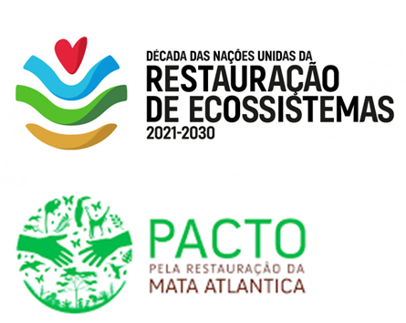

```{r meta, echo=FALSE, warning=FALSE}
library(metathis)
meta() %>%
  meta_general(
    description = "IX WORKSHOP SOBRE RESTAURAÇÃO FLORESTAL",
    generator = "xaringan and remark.js"
  ) %>% 
  meta_name("github-repo" = "franciscodalbertas/workshop_restauracao") %>% 
  meta_social(
    title = "workahop restauração",
    url = "https://´PREENCHER COM ENDERECO NETLIFY",
    image = "https://raw.githubusercontent.com/spcanelon/xaringan-basics-and-beyond/main/slides/day-01-cover-image.png",
    image_alt = "IX WORKSHOP SOBRE RESTAURAÇÃO FLORESTAL",
    og_type = "website",
    og_author = "Francisco d'Albertas",
    twitter_card_type = "summary_large_image",
    twitter_creator = "@FdAlbertas"
  )
```

```{r setup, include = FALSE}
options(htmltools.dir.version = FALSE)
library(knitr)
library(tidyverse)
library(xaringanExtra)
library(NHSRtheme)
library(NHSRdatasets)
library(icons)
# set default options
opts_chunk$set(echo=FALSE,
               collapse = TRUE,
               fig.width = 7.252,
               fig.height = 4,
               dpi = 300)
# set engines
knitr::knit_engines$set("markdown")
xaringanExtra::use_tile_view()
xaringanExtra::use_panelset()
xaringanExtra::use_clipboard()
xaringanExtra::use_webcam()
xaringanExtra::use_broadcast()
xaringanExtra::use_share_again()
xaringanExtra::style_share_again(
  share_buttons = c("twitter", "linkedin", "pocket")
)
# uncomment the following lines if you want to use the NHS-R theme colours by default
# scale_fill_continuous <- partial(scale_fill_nhs, discrete = FALSE)
# scale_fill_discrete <- partial(scale_fill_nhs, discrete = TRUE)
# scale_colour_continuous <- partial(scale_colour_nhs, discrete = FALSE)
# scale_colour_discrete <- partial(scale_colour_nhs, discrete = TRUE)
```

class: title-slide, right, top
background-image: url(slides/figuras/halfslide2.png), url(img/frame-art.png)
background-position: 90% 75%, 75% 75%
background-size: 100%

.right-column[
# `r rmarkdown::metadata$title`
### `r rmarkdown::metadata$subtitle`

**`r rmarkdown::metadata$author`**<br>
`r rmarkdown::metadata$date`
]


---
name: Apresentação
layout: false
class: about-me-slide, inverse, middle, center

# Apresentação


## Francisco d'Albertas

### Pesquisador de pós-doutorado

.fade[Instituto Internacional para Sustentabilidade, Rio de Janeiro]

[`r fontawesome::fa("link")` franciscodalbertas.netlify.app](https://franciscodalbertas.netlify.app/)
[`r fontawesome::fa("twitter", a11y = "sem")` @FdAlbertas](https://twitter.com/FdAlbertas)
[`r fontawesome::fa("github", a11y = "sem")` @franciscodalbertas](https://github.com/franciscodalbertas)

---
name: Introdução
layout: false
background-size: 100%
background-image: url(slides/figuras/peakpx.jpg)
class:inverse

.palegrey[.left[.footnote[Fonte: [www.peakpx.com ](https://www.peakpx.com/en/hd-wallpaper-desktop-gqmwd/download)]]]

???

mudanças climaticas, perda de biodiversidade etc, discorrer sobre!

---
name: Introdução
layout: false
background-size: 100%
background-image: url(slides/figuras/decada_restauracao.png)


# Restauração foi incluída na agenda política global

.pull-right[

```{r ,out.width="70%"}



# Restaurar 350 Mha de areas degradadas até 2030

```


]


???

- agenda restauração como solução possível: 
  - Bonn Challenge
  - UN decade of restoration (end 2030)
  - UN Biodiversity Conference (COP 15)
  - Pacto Mata Atlântica

argumentar sobre importância disso, custos, desafio etc

---
# Importância ecossitemas naturais

-mencionar alguns serviços ecossistemicos e oque são
-usar aquelas imagens de areas agricolas isoladas vs com veg. nativa

---
# Beneficios da natureza para as pessoas
## ou serviços ecossitêmicos

- degradação ambiental nivel planetário;

- começar falando sobre restauração, metas, importância; 2030, 2050!

- SE;

