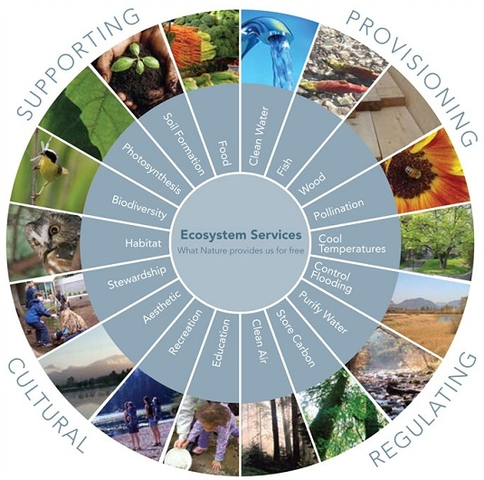
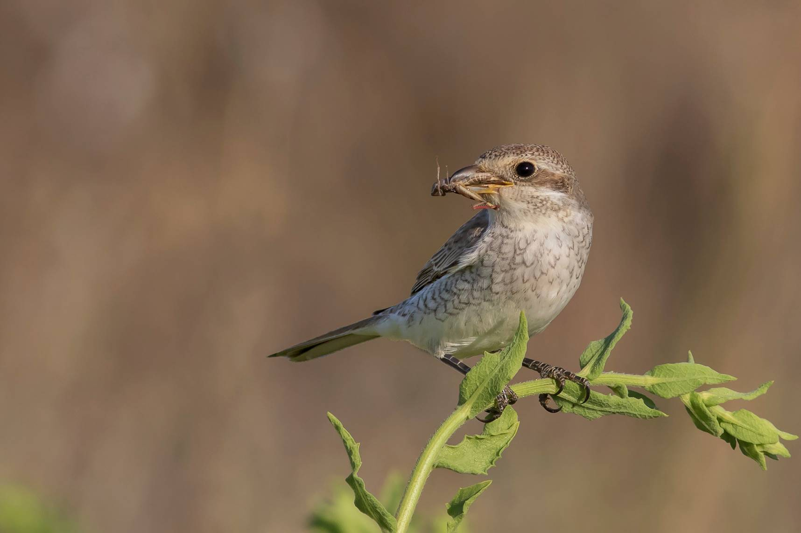
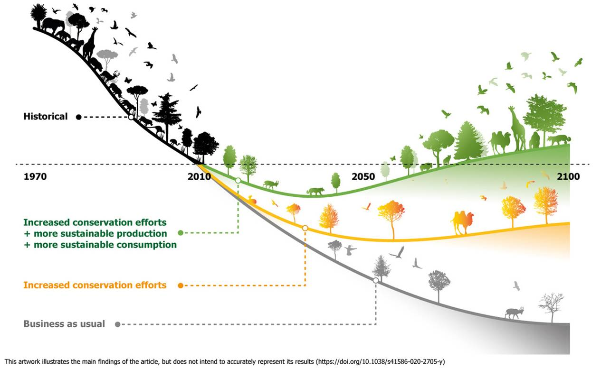
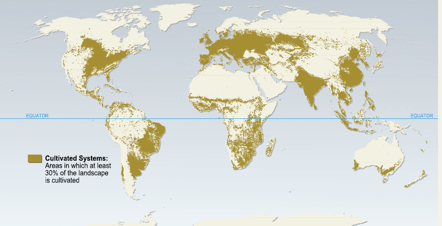
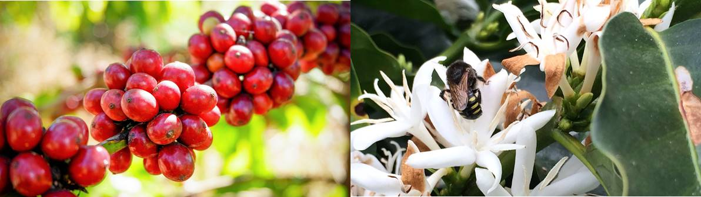
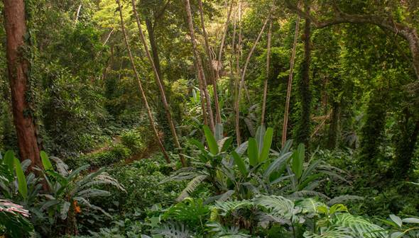
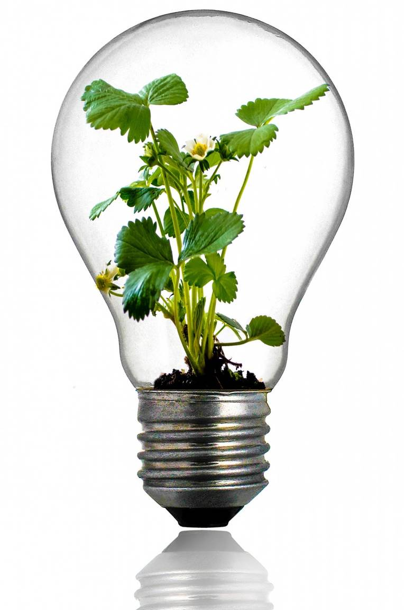
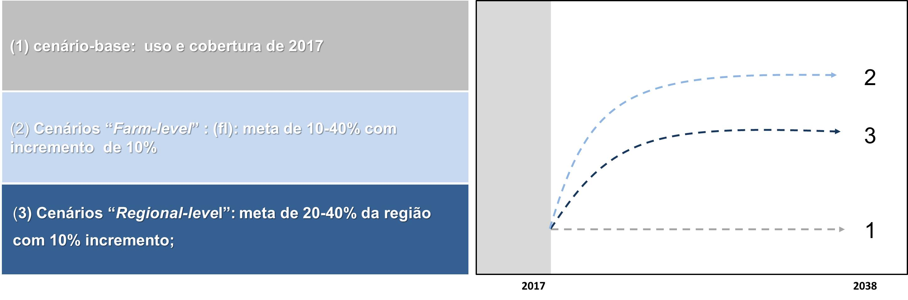
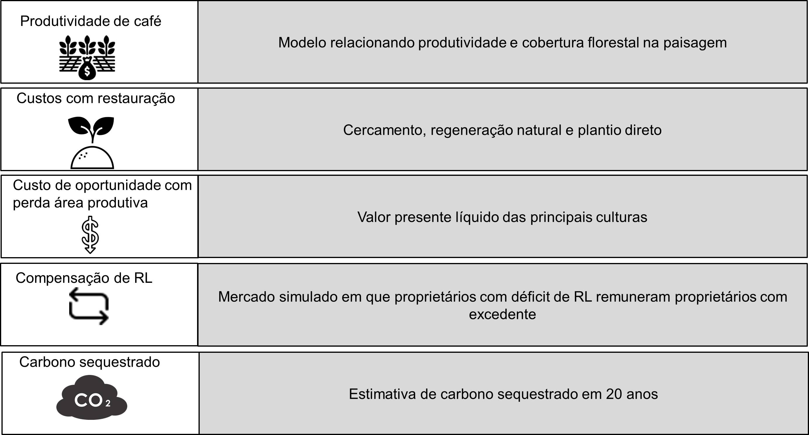

```{r meta, echo=FALSE, warning=FALSE}
library(metathis)
meta() %>%
  meta_general(
    description = "IX WORKSHOP SOBRE RESTAURAÇÃO FLORESTAL",
    generator = "xaringan and remark.js"
  ) %>% 
  meta_name("github-repo" = "franciscodalbertas/workshop_restauracao") %>% 
  meta_social(
    title = "workahop restauração",
    url = "https://workshoprestauracao.netlify.app/",
    image = "slides/figuras/coverimage.png",
    image_alt = "IX WORKSHOP SOBRE RESTAURAÇÃO FLORESTAL",
    og_type = "website",
    og_author = "Francisco d'Albertas",
    twitter_card_type = "summary_large_image",
    twitter_creator = "@FdAlbertas"
  )
```

```{r setup, include = FALSE}
options(htmltools.dir.version = FALSE)
library(knitr)
#library(tidyverse)
library(xaringanExtra)
#library(NHSRtheme)
#library(NHSRdatasets)
library(icons)
# set default options
opts_chunk$set(echo=FALSE,
               collapse = TRUE,
               fig.width = 7.252,
               fig.height = 4,
               dpi = 300)
# set engines
knitr::knit_engines$set("markdown")
xaringanExtra::use_tile_view()
xaringanExtra::use_panelset()
xaringanExtra::use_clipboard()
xaringanExtra::use_webcam()
xaringanExtra::use_broadcast()
xaringanExtra::use_share_again()
xaringanExtra::style_share_again(
  share_buttons = c("twitter", "linkedin", "pocket")
)
# uncomment the following lines if you want to use the NHS-R theme colours by default
# scale_fill_continuous <- partial(scale_fill_nhs, discrete = FALSE)
# scale_fill_discrete <- partial(scale_fill_nhs, discrete = TRUE)
# scale_colour_continuous <- partial(scale_colour_nhs, discrete = FALSE)
# scale_colour_discrete <- partial(scale_colour_nhs, discrete = TRUE)
```

class: title-slide, right, top
background-image: url(slides/figuras/halfslide2.png), url(img/frame-art.png)
background-position: 90% 75%, 75% 75%
background-size: 100%

.right-column[
# `r rmarkdown::metadata$title`
### `r rmarkdown::metadata$subtitle`

**`r rmarkdown::metadata$author`**<br>
`r rmarkdown::metadata$date`
]

```{css, echo = F}
.partial-bg {
  background-image: linear-gradient(0deg, red, blue);
}

.partial-bg50 {
  background-image: linear-gradient(90deg, gray 50%, white 50%);
}
```


---
name: Apresentação
layout: false
class: about-me-slide, inverse, middle, center


# Apresentação


## Francisco d'Albertas

### Pesquisador de pós-doutorado

.fade[Instituto Internacional para Sustentabilidade, Rio de Janeiro]

[`r fontawesome::fa("link")` franciscodalbertas.netlify.app](https://franciscodalbertas.netlify.app/)
[`r fontawesome::fa("twitter", a11y = "sem")` @FdAlbertas](https://twitter.com/FdAlbertas)
[`r fontawesome::fa("github", a11y = "sem")` @franciscodalbertas](https://github.com/franciscodalbertas)

---
name: Introdução
layout: false
background-size: 100%
background-image: url(slides/figuras/peakpx.jpg)
class:inverse

.palegrey[.left[.footnote[Fonte: [www.peakpx.com ](https://www.peakpx.com/en/hd-wallpaper-desktop-gqmwd/download)]]]

???

mudanças climaticas, perda de biodiversidade etc, discorrer sobre!

---
# Beneficios da natureza para as pessoas 

(serviços ecossistêmicos)


```{r ,out.width="38%", fig.align='center'}



# Restaurar 350 Mha de areas degradadas até 2030

```


.palegrey[.left[.footnote[Fonte: [The Economics of Ecosystems and Biodiversity: Ecological and Economic Foundations (2010) ](https://teebweb.org/publications/teeb-for/research-and-academia/)]]]

???

- degradação ambiental nivel planetário;

- começar falando sobre restauração, metas, importância; 2030, 2050!

- SE;

---

- Constanza et al. (2014) $^1$ estimaram  a contribuição total SE em  **USD 125 trilhões/ano**;

--

- a perda de SE entre 1997-2011 devido a mudanças no uso da terra foi estimada em **$4.3–20.2 trilhões/ano**;

--

- PIB global em 2011: **USD 68 trilhões**

--

- controle natural de pragas e polinização providos por áreas naturais:  10-1500 dólarer/hectare $^2$


.pull-left[

```{r echo=FALSE, fig.align='center',out.width="70%"}
knitr::include_graphics("slides/figuras/abelha.png")
```
]

.pull-right[

```{r echo=FALSE, fig.align='center',out.width="70%"}

```

]

.footnote[

[1]*R. Costanza,et al. Changes in the global value of ecosystem services. Global Environmental Change(2014)*

[2] *Pimentel et al. Economic and environmental benefits of biodiversity. BioScience (1997).*;*Lautenbach et al. Spatial and Temporal Trends of Global Pollination Benefit. en. PLoS ONE (2012).*; *Naranjo et al. Economic Value of Biological Control in Integrated Pest Management of Managed Plant Systems. Annual Review of Entomology (2015).* 

]


???

- Esses benefícios já foram estimados, no ano de 2011, em 125 trillhões de dolares anuais;

- A perda desses serviços pela degradação causada por mudanças no uso da terra é estimada em 4-20 trilhões/ano

- Para colocar isso em contexto, o PIB global em 2011 era de 68 trilhões;

- Indo para uma escala mais fina, o controle natural de pragas e a polinização são estimadas em 10-1500 dolares/ha;

---

.pull-left[

#Projeto Interface


]


.pull-right[.left[


```{r echo=FALSE, fig.align='center', out.width="60%"}


```

]
]


Planejar paisagens multifuncionais sustentáveis para que além das funções produtivas elas mantenham também parte da diversidade biológica original e das funções ecossistêmicas (coordenador: Jean Paul Metzger)

```{r echo=FALSE, fig.align='center', out.width="55%"}

knitr::include_graphics("slides/figuras/mapa_interface.jpg")

```

.palegrey[.left[.footnote[Fonte: [Boesinger et al., (2017). <br> Land use type, forest cover and forest edges <br> modulate avian cross-habitat spillover. ](https://besjournals.onlinelibrary.wiley.com/doi/full/10.1111/1365-2664.13032)]]]


---

background-size: 80%
background-image: url(slides/figuras/bending_curve.jpg)

```{r echo=FALSE, fig.align='center', out.width="75%"}
# 
```


.palegrey[.left[.footnote[Fonte: [Leclère, et al. Bending the curve of terrestrial biodiversity needs an integrated strategy. Nature (2020) ](https://tradehub.earth/wp-content/uploads/2020/11/LeClere-et-al.-2020-Bending-the-curve.-Nature.pdf/)]]]


???

Eu comecei essa apresentação falando da ameaça a biodiversidade 

E tb da importância da restauração, inclsusive em propriedades privadas!


E terminei o capitulo anterior falando sobre a importancia da restauração planejada, pra pra reverter a perda de biodiv. e serviços.


Eu gosto mto dessa figura pq ela iolutsra bem a necessidade de a gente  adotar uma trajetória de recuperação, que inclui esforços de conservação e uma produção mais sustentável, entre outros fatores;


---
name: Introdução
layout: false
background-size: 100%
background-image: url(slides/figuras/decada_restauracao.png)


# Restauração foi incluída na agenda política global

.pull-right[

```{r ,out.width="70%"}

knitr::include_graphics("slides/figuras/pacto_UN.png")

# Restaurar 350 Mha de areas degradadas até 2030

```


]


???

- agenda restauração como solução possível: 
  - Bonn Challenge
  - UN decade of restoration (end 2030)
  - UN Biodiversity Conference (COP 15)
  - Pacto Mata Atlântica

argumentar sobre importância disso, custos, desafio etc

---

```{r echo=FALSE, fig.align='center',out.width="100%"}

```

.palegrey[.left[.footnote[Fonte: [Millenium Ecosystem Acessment (2005) ](https://www.millenniumassessment.org/en/index.html)]]]

---
background-image: url(https://c.pxhere.com/images/eb/e3/0b37911ad6c25e99860ab7182d06-1596282.jpg!d)

# Intensificação convencional da agricultura


.palegrey[.left[.footnote[Fonte: [pxhere.com ](https://pxhere.com/pt/photo/1596282?utm_content=shareClip&utm_medium=referral&utm_source=pxhere)]]]


---
background-image: url(slides/figuras/eco_int.jpg)
background-size: 100%
class: inverse


# Intensificação ~~convencional~~ ecológica da agricultura

--

### **favorecimento dos organismos provedores de serviços ecossistêmicos:**

--

###   - manutenção de vegetação nativa;

--

###   - ações de restauração;

--

###   - adoção de boas práticas (ex. certificação agrícola)

.palegrey[.left[.footnote[Fonte: [Garibaldi et al., 2019. Policies for Ecological Intensification of Crop Production. ](https://www.sciencedirect.com/science/article/pii/S0169534719300187)]]]

---

- Os benefícios podem ser substanciais:

--

  - **Produtividade café pode aumentar 10 – 30%** (Projeto Interface)


```{r echo=FALSE, fig.align='center',out.width="70%"}





```

--

  - florestas tropicais restauradas podem retirar ~3 ton de carbono $ha^{–1}$ $ano^{–1}$ da atmosfera nos primeiros 20 anos;


```{r echo=FALSE, fig.align='center',out.width="45%"}





```


???


-  demanda crescente por prod. agric. mas isso tem que ser feito sem os impactos da intensificacao concencional 


- dada a situação posta, existe um desafio que a gente precisa enfrentar: como produzir de forma mais sustentável;

- A gente precisa de uma intensificação ecológica da agriculutra: ou seja, favorecer os organimos que provêem os SE.

- Ações como  
   - a manutenção de áreas de vegetação nativa;
   - restaurar áreas degradadas em paisagens agrícolas;
   - Adoção de boas práticas agrícolas, o que é cobrado por ex nos produtos agrícolas certificados -- vou falar mais pra frente sobre isso.
   
- Os benefícios dessas práticas podem ser importantes!

- Pro café por ex, os dados do Projeto em que meu doutorado está inserido, obtido por colegas mostram um aumento de produtividade entre 10-30% com a polinização.

- Na foto a gente vê uma abelha nativa polinizando uma flor de café, que depois vai gerar os frutos.

- Além disso, restaurar florestas em áreas agrícolas retira até 3 toneladas carbono da atmosfera por ha, reduzindo os efeitos do aquecimento global;


---

background-image: url("slides/figuras/contraste.png")
background-size: contain


---
class: partial-bg50 inverse


.pull-left[

### A restauração pode resultar em benefícios financeiros? Se sim, em que condições esses benefícios poderiam ser maiores que os custos?


### Como os custos se comparam com a renda de fazendas e com os preços do carbono negociado em mercados de crédito?
]

.pull-right[

```{r echo=FALSE, fig.align='center',out.width="70%"}





```


]

.palegrey[.left[.footnote[Fonte: [d'Albertas et a,. When do benefits from ecosystem restoration offset costs in coffee farms? Submetido ](https://github.com/franciscodalbertas/Tese/blob/main/index/_book/thesis.pdf)]]]


---

background-image: url("slides/figuras/studysite_compl.jpg")
background-size: contain

---

# Cenários: futuros plausiveis

restauração em fazendas de café

```{r echo=FALSE, fig.align='center',out.width="100%"}





```

.palegrey[.left[.footnote[Fonte: [d'Albertas et a,. When do benefits from ecosystem restoration offset costs in coffee farms? Submetido ](https://github.com/franciscodalbertas/Tese/blob/main/index/_book/thesis.pdf)]]]

---

variáveis calculadas em cada cenário

```{r echo=FALSE, fig.align='center',out.width="100%"}





```

---
background-image: url("slides/figuras/halfpage_right.png")
background-size: contain

# O que encontramos :
----

.palegrey[.left[.footnote[Fonte: [d'Albertas et a,. When do benefits from ecosystem restoration offset costs in coffee farms? Submetido ](https://github.com/franciscodalbertas/Tese/blob/main/index/_book/thesis.pdf)]]]

--

### Cenários cumprimento LPVN


.pull-left[

- Houve um aumento na produtividade;

- Esse aumento compensa em parte a perda de produção;

- O balanço financeiro geral foi negativo, mas não muito. 

- Ex: o cumprimento da LPVN implica em custo de 3% da renda média das fazendas (sem compensação); 


- Isso adicionaria 12 mil ha de vegetação nativa à região;

]


---
background-image: url("slides/figuras/halfpage_right.png")
background-size: contain

# O que encontramos :

.palegrey[.left[.footnote[Fonte: [d'Albertas et a,. When do benefits from ecosystem restoration offset costs in coffee farms? Submetido ](https://github.com/franciscodalbertas/Tese/blob/main/index/_book/thesis.pdf)]]

----


.pull-left[

- Considerando a quantidade inicial de vegetação, propriedades com ao menos 10% vegetação nativa tiveram uma grande vantagem, com ganho médio de 1.7 % na renda total, após atingir os 20%; 

- O cumprimento com a LPVN removeria 1.98-3.62 milhões de toneladas de CO2;


- Valores baixos (5/ton) para carbono não seriam suficientes pra compensar os gastos para todas as propriedades. Porém, com 20 dolares/ton, o balanço financeiro dos cenários seria positivo;

- Existe um limiar em torno de 25% cobertura florestal -- acima disso, os custos com restauração se elevam mais;


]


]

---
background-image: url("slides/figuras/halfpage_right.png")
background-size: contain

# Conclusão :

.palegrey[.left[.footnote[Fonte: [d'Albertas et a,. When do benefits from ecosystem restoration offset costs in coffee farms? Submetido ](https://github.com/franciscodalbertas/Tese/blob/main/index/_book/thesis.pdf)]]

----


.pull-left[

- O cumprimento da LPVN não necessariamente leva a perdas financeiras no longo prazo -- pode até representar ganhos, dependendo da quantidade de vegetação nativa;

- Políticas adicionais de incentivo, como mercado de carbono tornariam a restauração altamente viável;


]


]


