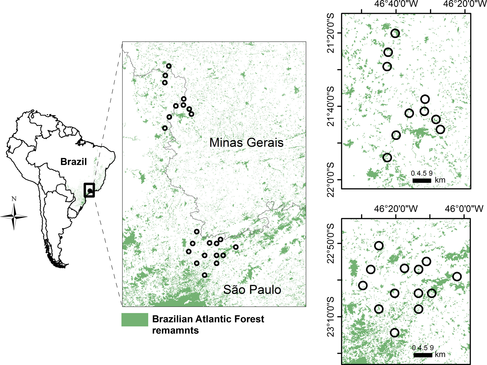

```{r meta, echo=FALSE, warning=FALSE}
library(metathis)
meta() %>%
  meta_general(
    description = "IX WORKSHOP SOBRE RESTAURAÇÃO FLORESTAL",
    generator = "xaringan and remark.js"
  ) %>% 
  meta_name("github-repo" = "franciscodalbertas/workshop_restauracao") %>% 
  meta_social(
    title = "workahop restauração",
    url = "https://workshoprestauracao.netlify.app/",
    image = "slides/figuras/coverimage.png",
    image_alt = "IX WORKSHOP SOBRE RESTAURAÇÃO FLORESTAL",
    og_type = "website",
    og_author = "Francisco d'Albertas",
    twitter_card_type = "summary_large_image",
    twitter_creator = "@FdAlbertas"
  )
```

```{r setup, include = FALSE}
options(htmltools.dir.version = FALSE)
library(knitr)
#library(tidyverse)
library(xaringanExtra)
#library(NHSRtheme)
#library(NHSRdatasets)
library(icons)
# set default options
opts_chunk$set(echo=FALSE,
               collapse = TRUE,
               fig.width = 7.252,
               fig.height = 4,
               dpi = 300)
# set engines
knitr::knit_engines$set("markdown")
xaringanExtra::use_tile_view()
xaringanExtra::use_panelset()
xaringanExtra::use_clipboard()
xaringanExtra::use_webcam()
xaringanExtra::use_broadcast()
xaringanExtra::use_share_again()
xaringanExtra::style_share_again(
  share_buttons = c("twitter", "linkedin", "pocket")
)
# uncomment the following lines if you want to use the NHS-R theme colours by default
# scale_fill_continuous <- partial(scale_fill_nhs, discrete = FALSE)
# scale_fill_discrete <- partial(scale_fill_nhs, discrete = TRUE)
# scale_colour_continuous <- partial(scale_colour_nhs, discrete = FALSE)
# scale_colour_discrete <- partial(scale_colour_nhs, discrete = TRUE)
library(xaringanthemer)

style_mono_accent(
  base_color = "#1c5253",
  header_font_google = google_font("Josefin Sans"),
  text_font_google   = google_font("Montserrat", "300", "300i"),
  code_font_google   = google_font("Fira Mono")
)

```

class: title-slide, right, top
background-image: url(slides/figuras/halfslide2.png), url(img/frame-art.png)
background-position: 90% 75%, 75% 75%
background-size: 100%

.right-column[
# `r rmarkdown::metadata$title`
### `r rmarkdown::metadata$subtitle`

**`r rmarkdown::metadata$author`**<br>
`r rmarkdown::metadata$date`
]

```{css, echo = F}
.partial-bg {
  background-image: linear-gradient(0deg, red, blue);
}

.partial-bg50 {
  background-image: linear-gradient(90deg, gray 50%, white 50%);
}


```
???

bom dia, é um prazer estar aqui. Nessa conversa eu vou abordar um pouco sobre a certificação agrícola e a restauração florestal, usando o contexto do meu trabalho de doutorado.

---
name: Apresentação
layout: false
class: about-me-slide, inverse, middle, center


# Apresentação


## Francisco d'Albertas

### Pesquisador de pós-doutorado

.fade[Instituto Internacional para Sustentabilidade, Rio de Janeiro]

[`r fontawesome::fa("link")` franciscodalbertas.netlify.app](https://franciscodalbertas.netlify.app/)
[`r fontawesome::fa("twitter", a11y = "sem")` @FdAlbertas](https://twitter.com/FdAlbertas)
[`r fontawesome::fa("github", a11y = "sem")` @franciscodalbertas](https://github.com/franciscodalbertas)

???

Primeiro, me apresentando, eu sou biólogo de formação e fiz mestrado e doutorado em Ecologia. Hj eu trabalho como pesquisador de pos-doutorado no IIS.

Essa palestra e outras informações sobre o meu trabalho estão no meu site, pra quem tiver interesse. 

---
name: Introdução
layout: false
background-size: 100%
background-image: url(slides/figuras/peakpx.jpg)
class:inverse

.palegrey[.left[.footnote[Fonte: [www.peakpx.com ](https://www.peakpx.com/en/hd-wallpaper-desktop-gqmwd/download)]]]

???

Eu escolhi começar com uma imagem meio dramática, mas que acho que simboliza bem o contexto atual da nossa relação com a natureza.

A ação humana é tão intensa sobre o planeta que é comparável a uma força geológica.

A diminuição de habitats naturais e as emissões de carbono são grandes causadoras das mudanças climáticas

Essa redução de habitats e o aquecimento são uma grande ameaça a biodiversidade da terra.

Mas quais são as consequências para nós?

---
# Beneficios da natureza para as pessoas 

(serviços ecossistêmicos)


```{r ,out.width="38%", fig.align='center'}


# Restaurar 350 Mha de areas degradadas até 2030

```


.palegrey[.left[.footnote[Fonte: [The Economics of Ecosystems and Biodiversity: Ecological and Economic Foundations (2010) ](https://teebweb.org/publications/teeb-for/research-and-academia/)]]]

???

- Eu poderia falar de muitas coisas. Mas escolhi dar um enfoque nos benefícios da naturesa para a humanidade. 

- Nossa vida e bem-estar dependem de uma série de serviços prestados pela natureza.

- Esses serviços podem ser classificados de diversas formas. Incluem a provisão de água, fibras, remédios, alimentas. A regulação do clima do planeta...além do bem-estar em se visitar parques nacionais por exemplo, ou de comtemplar paisagens naturais.


---

- Constanza et al. (2014) $^1$ estimaram  a contribuição total SE em  **USD 125 trilhões/ano**;

???

- De fato, esses benefícios já foram estimados, no ano de 2011, em 125 trillhões de dolares anuais;


--

- a perda de SE entre 1997-2011 devido a mudanças no uso da terra foi estimada em **$4,3–20,2 trilhões/ano**;


???

- A perda desses serviços pela degradação causada por mudanças no uso da terra é estimada em 4-20 trilhões/ano

--

- PIB global em 2011: **USD 68 trilhões**

???

- Para colocar isso em contexto, o PIB global em 2011 era de 68 trilhões;

- Ou seja, os beneficios são consideravelmente maiores que o PIB global.

--

- controle natural de pragas e polinização providos por áreas naturais:  10-1500 dólarer/hectare $^2$


.pull-left[

```{r echo=FALSE, fig.align='center',out.width="70%"}
knitr::include_graphics("slides/figuras/abelha.png")
```
]

.pull-right[

```{r echo=FALSE, fig.align='center',out.width="70%"}
knitr::include_graphics("slides/figuras/controle.pragas.jpg")
```

]


.footnote[ 

Fonte: [1] [R. Costanza,et al. Changes in the global value of ecosystem services (2014)](https://doi.org/10.1016/j.gloenvcha.2014.04.002)


Fonte: [2] [Pimentel et al. Economic and environmental benefits of biodiversity(1997)](https://www.jstor.org/stable/1313097); [Lautenbach et al. Spatial and Temporal Trends of Global Pollination Benefit (2012)](https://doi.org/10.1371/journal.pone.0035954); [Naranjo et al. Economic Value of Biological Control in Integrated Pest Management of Managed Plant Systems (2015)](10.1146/annurev-ento-010814-021005);


]


???


- Indo para uma escala mais fina, o controle natural de pragas e a polinização , que são diretamente relacionados à produção agrícola, são estimadas em 10-1500 dolares/ha;

---

.pull-left[

#Projeto Interface


]


.pull-right[.left[


```{r echo=FALSE, fig.align='center', out.width="80%"}

knitr::include_graphics("slides/figuras/fapesp_interface.png")

```

]
]


.left-column["*Planejar paisagens multifuncionais sustentáveis para que além das funções produtivas elas mantenham também parte da diversidade biológica original e das funções ecossistêmicas*" (coordenador: Jean Paul Metzger)
]

.right-column[

```{r echo=FALSE, fig.align='center', out.width="65%"}



```

]


.footnote[

Fonte: [Boesinger et al., (2017). <br> Land use type, forest cover and forest edges <br> modulate avian cross-habitat spillover. ](https://besjournals.onlinelibrary.wiley.com/doi/full/10.1111/1365-2664.13032)

]

???

- Como esses serviços são tão importantes, tem um grande número de pesquisas sendo desenvolvidas sobre eles.

- Em particular, durante o mestrado e o doutorado, eu fiz parte de um projeto temático da FAPESP que tinha como objetivo auxiliar a planejar paisagens agrícolas que fossem capazes de conciliar a conservação da biodiversidade e dos SE com a produção.

- O projeto foi baseado no estudo em diversas paisagens -- que são representadas por essas bolas -- em MG e SP, em que os pesquisadores mediam as relações entre a provisão de SE e os diferentes usos da terra: a quantidade de mata, agricultura, pastagens. 

---

background-size: 80%
background-image: url(slides/figuras/bending_curve.jpg)

```{r echo=FALSE, fig.align='center', out.width="75%"}
# knitr::include_graphics("slides/figuras/bending_curve.jpg")
```


.palegrey[.left[.footnote[Fonte: [Leclère, et al. Bending the curve of terrestrial biodiversity needs an integrated strategy. Nature (2020) ](https://tradehub.earth/wp-content/uploads/2020/11/LeClere-et-al.-2020-Bending-the-curve.-Nature.pdf/)]]]


???

- Os resultados encontrados corroboram muitos outros estudos que reconhecem a importância de se conservar ambientes naturais, pra manter os se.

- Na realidade, se queremos uma trajetória sustentável para o futuro, são necessárias diversas ações:

  - aumentar o esforço de conservação e restauração de áreas degradadas;
  - promover uma produção agrícola mais sustentável;
  - promover um consumo mais sustentável;


- Eu gosto mto dessa figura pq ela iolutsra bem a necessidade de a gente  adotar uma trajetória de recuperação, que inclui todos esses esforços;

- Hj eu pretendo focar mais em 2 ações: 

  - ações de restauração em paisagens agrícolas;
  - produção mais sustentável;


---
name: Introdução
layout: false
background-size: 100%
background-image: url(slides/figuras/decada_restauracao.png)


# Restauração foi incluída na agenda política global

.pull-right[

```{r ,out.width="70%"}

knitr::include_graphics("slides/figuras/pacto_UN.png")

# Restaurar 350 Mha de areas degradadas até 2030

```


]


???

- Felizmente, a restauração foi incluída na agenda política global;

- Uma série de metas ambiciosas foram estabelecidas; como por exemplo o pacto pela restauração da Mata Atlântica. 

- Justamente por isso, a ONU declarou essa década como a década da restauração.


- agenda restauração como solução possível: 
  - Bonn Challenge
  - UN decade of restoration (end 2030)
  - UN Biodiversity Conference (COP 15)
  - Pacto Mata Atlântica


---


```{r echo=FALSE, fig.align='center',out.width="100%"}
knitr::include_graphics("slides/figuras/agriculture_surface.png")
```

.palegrey[.left[.footnote[Fonte: [Millenium Ecosystem Acessment (2005) ](https://www.millenniumassessment.org/en/index.html)]]]


???

- Reconhecendo que a restauração é importante, eu trouxe essa imagem, que já antiga, mas que ilustra e extensão da superficie terrestre que eh coberta por agricultura, pelo menos 30%;

- Olhando pra isso, dá pra entender que vai ser mto difícil falar em restauração sem pensar em restaurar tb paisagens agrícolas.

---
background-image: url(https://c.pxhere.com/images/eb/e3/0b37911ad6c25e99860ab7182d06-1596282.jpg!d)

# Intensificação convencional da agricultura


.footnote[

[pxhere.com ](https://pxhere.com/pt/photo/1596282?utm_content=shareClip&utm_medium=referral&utm_source=pxhere)

]


???

- nesse sentido, é importante que a gente aumente a produtividade agrícola, pra poder produzir mais em menos área, deixando espaço pra outros usos do solo tb;

- essa imagem ilustra bem a intensificação mais convencional da agricultura, com uso de insumos, maquinario. Claro que ela tem sua importância, mas essa forma de produzir tb gera muitos impactos.

- Esse tipo de paisagem é um verdadeiro deserto verde pra outros organísmos.

- Por isso, é importante que a gente tb considere tb formas alternativas de intensificar a produção;

---
background-image: url(slides/figuras/eco_int.jpg)
background-size: 100%
class: inverse


# Intensificação ~~convencional~~ ecológica da agricultura


???

- É possível realizar uma intensificação ecológica da agricultura, manejando a paisagem e os organísmos que proveem SE que beneficiam a produção.

--

### **favorecimento dos organismos provedores de serviços ecossistêmicos:**

???

- isso pode ser feito por ex, mantendo vegetação nativa, ou criando manchas de habitat, como esse corredor que aparece na foto, na california.


--

###   - manutenção de vegetação nativa;

--

###   - ações de restauração;

???

- a própria restauração de manchas de habitat tb pode contribuir pro aumento da provisão de SE como a polinização e o controle de pragas.

--

###   - adoção de boas práticas (ex. certificação agrícola)

.palegrey[.left[.footnote[Fonte: [Garibaldi et al., 2019. Policies for Ecological Intensification of Crop Production. ](https://www.sciencedirect.com/science/article/pii/S0169534719300187)]]]

???


- alem disso, as boas praticas promovidas por certificações tb vão nessa direção;


---

### Os benefícios podem ser substanciais:

???

- Os benefícios dessas práticas podem ser importantes!


--

.pull-left[

  - **Produtividade café pode aumentar 10 – 30%** (Projeto Interface) $^1$


```{r echo=FALSE, fig.align='center',out.width="100%"}


knitr::include_graphics("slides/figuras/adrian_result.jpg")


```

]

???

- Pro café por ex, os dados do Projeto em que meu doutorado está inserido, obtido por colegas mostram um aumento de produtividade entre 10-30% com a polinização.

- explicar o gráfico


--


.pull-right[


  - florestas tropicais restauradas podem retirar ~3 ton de carbono $ha^{–1}$ $ano^{–1}$ da atmosfera nos primeiros 20 anos  $^2$;


```{r echo=FALSE, fig.align='center',out.width="100%"}


knitr::include_graphics("slides/figuras/forest.jpg")


```


]


.footnote[

Fonte: [1] [González-Chaves, et al., 2021. Positive forest cover effects on coffee yields are consistent across regions](https://besjournals.onlinelibrary.wiley.com/doi/epdf/10.1111/1365-2664.14057)


Fonte: [2] [Poorter, L.et al., 2016. Biomass resilience of Neotropical secondary forests](ttps://doi.org/10.1038/nature16512)


]


???

- Além disso, restaurar florestas em áreas agrícolas retira até 3 toneladas carbono da atmosfera por ha, reduzindo os efeitos do aquecimento global;


---

background-image: url("slides/figuras/contraste.png")
background-size: contain


???

- portanto, pegando essas 2 situações contrastantes:

   - comparando a imagem da esquerda com a da direita, é razoável supor que na da direta, com plantações de café cercadas de florestas, a provisão de SE deve ser muito maior...e beneficiar a produção
   
   
- Porem, além dos beneficios, é evidente, no caso da restauração por exemplo, que existem custos envolvidos.

- é importante fazer uma análise de custos e benefícios de ações de restauração em paisagens agrícolas, pra um melhor planejamento de paisagens;

---
class: partial-bg50 inverse


.pull-left[

### A restauração pode resultar em benefícios financeiros? Se sim, em que condições esses benefícios poderiam ser maiores que os custos?

### Como os custos se comparam com a renda de fazendas e com os preços do carbono negociado em mercados de crédito?

]


.pull-right[

```{r echo=FALSE, fig.align='center',out.width="70%"}


```


]

.palegrey[.left[.footnote[Fonte: [d'Albertas et al. When do benefits from ecosystem <br> restoration offset costs in coffee farms? Submetido ](https://github.com/franciscodalbertas/Tese/blob/main/index/_book/thesis.pdf)]]]


???

Nós nos propusemos então a fazer essa análise de custos e benefícios e responder as seguintes perguntas.

### A restauração pode resultar em benefícios financeiros? Se sim, em que condições esses benefícios poderiam ser maiores que os custos?

### Como os custos se comparam com a renda de fazendas e com os preços do carbono negociado em mercados de crédito?


---

background-image: url("slides/figuras/studysite_compl.jpg")
background-size: contain

**507 propriedades produtoras de café**


???

- pra responder essa pergunta, a gente selecionou 507 propriedades na região Mogiana e Sul de Minas -- onde o Projeto Interface atuou.

- A figura da esquerda mostra em verde os municipios que trabalhamos e em rosa os outros municipios da mata atlantica que tb cultivam café;

- A direita temos os limites dessas propriedades.p

---

# Cenários: futuros plausiveis

restauração em fazendas de café

 .panelset[
   .panel[.panel-name[cenários]

```{r echo=FALSE, fig.align='center',out.width="80%"}


knitr::include_graphics("slides/figuras/cenarios.jpg")


```


]


.panel[.panel-name[Farm-level vs. Regional-level]
   

.pull-left[


farm-level (fl)


]

.pull-right[

regional-level (rl)


]

]


]

???

- Com essas propriedades, a gente simulou cenários de restauração usando como ponto de partida 2017 até 2037 (20 anos)

- A gente estabeleceu como objetivo que as propriedades atingissem 10,20,30 e 40% de cobertura;

- Tb fizemos um conjunto de cenarios em que ao inves de cada fazenda ser restaurada, alocamos a restauracao nas áreas de menor custo, pra atingir 20,30 ou 40% de cobertura na área total das fazendas -- nao necessariamente atingindo todas. Nesse caso, apenas as APPs foram obrigatoriamente restauradas. 


- Mostrar o gif


---

variáveis calculadas em cada cenário

```{r echo=FALSE, fig.align='center',out.width="100%"}


knitr::include_graphics("slides/figuras/variaveis_cenarios.jpg")


```

???

- Nesses cenários, a gente calculou uma série de variáveis pra fazer o balanço de custos e benefícios;

- Comentar cada um deles.

---
background-image: url("slides/figuras/halfpage_right.png")
background-size: contain

# O que encontramos :
----

.palegrey[.left[.footnote[Fonte: [d'Albertas et al. When do benefits from ecosystem restoration offset costs <br> in coffee farms? Submetido ](https://github.com/franciscodalbertas/Tese/blob/main/index/_book/thesis.pdf)]]]

???

- Vou apresentar os resultados que a gente encontrou, focando nos pontos principais


--

#### Cenários cumprimento LPVN


???

- Do ponto de vista prática, os cenários mais relevantes são os que permitiriam o cumprimento da lei de proteção da vegetação nativa, ou seja, os cenários com meta de atingir 20% de cobertura de vegetação nativa;


--

.pull-left[

- Houve um aumento na produtividade;

{{ content}}

]

???

- Como a gente esperava, segundo nosso modelo, houve aumento de produtividade com aumento da cobertura florestal


--

+  Esse aumento compensa em parte os custos;

{{ content}}


???

Esse aumento compensou em parte os custos com perda de produção e gastos com restauração

--

+ O balanço financeiro geral foi negativo, mas não muito;

{{ content}}

???

- Mesmo, assim, o balanço financeiro em média foi ligeiramente negativo -- mas não muito;

--

+ Ex: o cumprimento da LPVN implica em custo de 3% da renda média das fazendas; 

{{ content}}


???

- O balanço representou um custo de 3% da renda média das fazendas, no cenário em que todas elas atingem 20% de cobertura -- menos ainda nos cenários regionais.

--

+ Isso adicionaria 12 mil ha de vegetação nativa à região;

{{ content}}

???

- Nesse caso, nos teriamos apenas nessas proprieddes um adicional de 12mil ha de florestas na região, oq é um numero significativo!


---
background-image: url("slides/figuras/halfpage_right.png")
background-size: contain

# O que encontramos :


----

.footnote[

Fonte: [d'Albertas et al. When do benefits from ecosystem restoration offset costs <br> in coffee farms? Submetido ](https://github.com/franciscodalbertas/Tese/blob/main/index/_book/thesis.pdf)

]


--

.pull-left[

- Considerando a quantidade inicial de vegetação, propriedades com ao menos 10% vegetação nativa tiveram vantagem, com ganho médio de 1,7 % na renda total, após atingir os 20%; 

{{content}}

]

???

- Uma coisa interessante que encontramos é que quem conservou mais foi beneficiado. Quando a gente considerou a quntidade inicial de florestas, as propriedades com ao menos 10% de veg. nativa tiveram um balanço positivo, com ganho médio de 1,7% sobre a renda total das propriedades;


--

+ O cumprimento com a LPVN removeria 1,98-3,62 milhões de toneladas de $CO_2$;

{{content}}

???

- Além disso, a restauração removeria uma grande quantidade de carbono

--

+ Valores baixos (5/ton) para carbono não seriam suficientes pra compensar os gastos para todas as propriedades. Porém, com 20 dolares/ton, o balanço financeiro dos cenários seria positivo;

{{content}}

???

- Esse carbono pode ser comercializado em mercados de carbono

- Com valores baixos, não seria suficiente pra compensar os gastos de todas as propriedades.

- mas com uma remuneração de 20 dolares/ton, o balanço financeiro mesmo dos cenários mais ambiciosos, com 30-40% de cobertura, seria positivo.

--


+ Existe um limiar (~25% cobertura). Acima disso, os custos com restauração se elevam muito;

{{content}}

???

- Além disso, a gente verificou que existe um limiar de cobertura, em torno de 25%, acima do qual os custos com restauração se elevam muito.

---
background-image: url("slides/figuras/halfpage_right.png")
background-size: contain

# Conclusão :

.footnote[

Fonte: [d'Albertas et a,. When do benefits from ecosystem restoration offset costs <br> in coffee farms? Submetido ](https://github.com/franciscodalbertas/Tese/blob/main/index/_book/thesis.pdf)

]

----


--

.pull-left[

- O cumprimento da LPVN não necessariamente leva a perdas financeiras no longo prazo -- pode até representar ganhos, dependendo da quantidade de vegetação nativa;

{{content}}


]

???

- O cumprimento da LPVN não necessariamente leva a perdas financeiras no longo prazo -- pode até representar ganhos, dependendo da quantidade de vegetação nativa;


--

+ Políticas adicionais de incentivo, como mercado de carbono tornariam a restauração altamente viável;

{{content}}


???

- Políticas adicionais de incentivo, como mercado de carbono tornariam a restauração altamente viável;

---

background-image: url("slides/figuras/fundo_certif.jpg")
background-size: contain
class: inverse

# E a certificação ambiental?

--


???

- encerrada a parte de restauração, eu queria falar agora sobre o outro trabalho que a gente desenvolveu, focado em certificação ambiental

### Boas práticas (socioambientais, econômicas);

???

- as certificações são um conjunto de boas práticas socioambientais e econômicas que o produtor certificado tem que seguir;

- Essas ações vão desde seguir leis trabalhista, politicas de inclusao a praticas ambientais como cumprimento da legislação ou manter vegetação nativa;

--

### Adesão voluntária;

???

- elas são de adesão voluntária

--

### Acesso a novos mercados;

???

- muitas vezes, elas podem fornecer acesso a novos mercados, que remuneram melhor por um produto de maior qualidade;

--

### Impactos mensuráveis;

???

- Existe é claro uma preocupação sobre se os impactos da certificação são mensuráveis e podem ser de fato atribuidos a ela. Ex. será que propriedades que procuram a certificação já possuem praticas mais sustentáveis e por isso memso decidem se certificar?


---

# Distribuição das principais culturas certificadas nos trópicos


.footnote[

Fonte: [Tayleur et al. Where are commodity crops certified, and what does it mean for conservation and poverty alleviation?(2018). ](https://www.sciencedirect.com/science/article/pii/S0006320716309582)

]

```{r echo=FALSE, fig.align='center',out.width="100%"}


knitr::include_graphics("slides/figuras/certification_map.jpg")


```


???

O mapa mostra a distribuição das principais culturas certificadas, concentradas nos tropicos.

No Brasil e na A. do Sul a gente ve uma grande concentração de café


---


```{r echo=FALSE, fig.align='center',out.width="62%"}


```


.footnote[

Fonte: [Meemken et al. Sustainability standards in global agrifood supply chains (2021) ](https://www.nature.com/articles/s43016-021-00360-3)

]

???

- Aqui nessa figura a gente ve q as principais certificacoes sao organicam fairtrade e rainforest alliance tanto em produção como em área plantada.

- E o café e cacao são as culturas com a maior porcentagem da produção certificada, mais de 20%.


- Portanto, partindo do contexto de que a certificação ja eh bastante relevante pra culturas como o café, e tem crescido pra outros cultivos, a gente resolveu investigar se era possivel detectar efeitos da certificação em algumas variaveis que a gente considera importante pra conservação, e que são possiveis de medir remotamente;

---
class: partial-bg50 inverse


.pull-left[

### A certificação tem um efeito detectável:

### No desmatamento?
### Na regeneração de vegetação?
### Cumprimento da legislação?

]

.pull-right[

```{r echo=FALSE, fig.align='center',out.width="70%"}


# colocar em css chunk faz ;pull-left empilhados
# <!-- .pull-left ~ * { clear: unset; } -->
# <!-- .pull-left + * { clear: both; } -->

```


]

.palegrey[.left[.footnote[Fonte: [d'Albertas et a,. Agricultural certification as a synergistic tool <br> for environmental law compliance. Submetido ](https://github.com/franciscodalbertas/Tese/blob/main/index/_book/thesis.pdf)]]]

???

- Pra tentar clarear o efeito da certificação pra conservação, a gente resolveu olhar pra métricas faceis de serem medidas, e com um historico de dados antes de depois da certificação;

### A certificação tem um efeito detectável:

### No desmatamento?
### Na regeneração de vegetação?
### Cumprimento da legislação?

---


???

- A gente trabalhou com um conjunto de propriedades certificados pelo Imaflora com o selo rainforest alliance

- Muncipios no Cerrado e na Mata Atlantica

- Eu cruzei os dados do Car pros municipios certificados e tb selecionei todas as propriedades desses municipios como controle

- A figura da esquerda mostra os municipios usados e qnto mais amarelos mais propriedades certificadas.

- As propriedades podem ser certificadas em grupo ou individualmente. A figura b mostra a qntidade de fazendas por contrato de certiticação e o tempo de certificação de cada contrato.

---

# Análise contrafactual robusta: *Diferença-das-diferenças*

--

#### Pareamento de propriedades tratamento e controle


.pull-left[


]

???

-Pra comparar as propriedades certificadas e controle, a gente usou um procedimento estatistico chamado matching.

-Nele, a gente pegou caracteristicas que a gente considerou importante tanto pras propriedades controle como pras tratamento e selecionou no caso das controle, as propriedades que eram semelhantes as tratadas, com exceção da certificação.


--

.pull-right[

#### Comparação de fazendas certificadas e não certificadas *ANTES* e *DEPOIS* 

  {{content}}
  
]


???

- Depois de parar a propriedades, a gente usou uma outra técnica chamado de diferença das diferenças, em que a gente comparou a diferença entre nossas variáveis de interesse nos grupos tratamento e controle fazendo uma regressão entre as variáveis resposta e a interação entre o tratamento (certificação) e o tempo;

--

+ taxa de desmatamento;

{{content}}

--

+ taxa de regeneração;

{{content}}

--

+ déficit de RL;

{{content}}

--

+ proporção de cobertura APPs;

{{content}}

---
background-image: url("slides/figuras/halfpage_right.png")
background-size: contain

# O que encontramos :


----

.palegrey[.left[.footnote[Fonte: [d'Albertas et al. Agricultural certification as a synergistic tool for <br> environmental law compliance. Submetido ](https://github.com/franciscodalbertas/Tese/blob/main/index/_book/thesis.pdf)]]]

--

.pull-left[

- Fazendas certificadas e não certificadas tiveram taxas muito baixas de desmatamento e regeneração;


{{content}}

]

--

+ Não houve diferença entre os grupos;

{{content}}


--


+ também não houve diferença de cobertura de vegetação em RL (fora de APP)

{{content}}

--

+ encontramos evidências de que fazendas certificadas apresentaram aumento na cobertura em APP, na Mata Atlântica;

{{content}}

---
background-image: url("slides/figuras/halfpage_right.png")
background-size: contain

# O que encontramos :
----

.palegrey[.left[.footnote[Fonte: [d'Albertas et al.Agricultural certification as a synergistic tool for <br> environmental law compliance. Submetido ](https://github.com/franciscodalbertas/Tese/blob/main/index/_book/thesis.pdf)]]]

--


.pull-left[

- A ausência de efeito pode estar relacionada as características das regiões de estudo e da produção de café:
  

{{content}}

]

???

- a falta de efeito provavelmente se deve a caracteristicas da regiao, q sao tipicos atratores de certificação: cadeia de suprimentos desenvolvida, alta aptidao agrícola, baixo risco ambiental e social. Nessas áreas, de uso do solo ja consolidado, o efeito da certificação sobre desmatamento e regeneração tende a ser menor mesmo.

--


  + regiões consolidadas;
  
  {{content}}
  
--
  
  + Alto controle na cadeia produtiva;
  
  {{content}}
  
--
  
  + Existência legislações ambientais ja restritivas;
  
  {{content}}
  


---
background-image: url("slides/figuras/halfpage_right.png")
background-size: contain


.footnote[

Fonte: [d'Albertas et al.Agricultural certification as a synergistic tool for <br> environmental law compliance. Submetido ](https://github.com/franciscodalbertas/Tese/blob/main/index/_book/thesis.pdf)

]

# O que encontramos :

----


.pull-left[

- Há potencial para expandir benefícios da certificação para RL -- no caso de fazendas com deficit. Ex. reconhecer propriedades que favorecem vegetação nativa;

{{content}}

]

???

- Alem disso, mesmo em regiões consolidades, a gente sugerem q existe impacto pra aumentar a adicionalidade. Por ex, usando a legislação ambeintal, identificando as fraquezas no seu cumprimento e facilitando a adequação.

- Por ex., poderia haver em alguns casos incentivo a restauração de RL, combinadas com mecanismos de compensação como PSA, subsídios ou assistencia tecnica.

--

+ Isso pode ser fortalecido considerando que os custos com restauração podem ser ( ao menos em parte) compensados com ganhos de produtividade; 

{{content}}


---
background-image: url("slides/figuras/halfpage_right.png")
background-size: contain

# Conclusão

----

--

.pull-left[

- Os resultados contribuem para o número ainda limitado de estudos focados no impacto ambiental da certificação, usando metodologias robustas;

{{content}}

]

--

+ A certificação em área consolidadas não teve efeito detectado em reduzir desmatamento ou aumentar a regeneração natural;

{{content}}

--


+ Porém, a certificação pode ser um incetivo adicional para adequação a LPVN, por exemplo, no caso das APPs;

{{content}}

---


# Mensagens finais 

----

--

- É possível aliar a manutenção ou aumento da produção agrícola com maior proteção da biodiversidade e sequestro de carbono da atmosfera, por meio da restauração;

--

- Nesse caso  políticas complementares são importantes, como a regulamentação de um mercado de carbono;

--

- A certificação em uma região de agricultura consolidada não teve um efeito detectável em reduzir o desmatamento ou em aumentar a taxa de regeneração de vegetação nativa;


--

- Entretanto, a certificação pode servir como um estímulo adicional para o cumprimento da legislação ambiental;


---
class: center, middle, inverse


# Obrigado!


